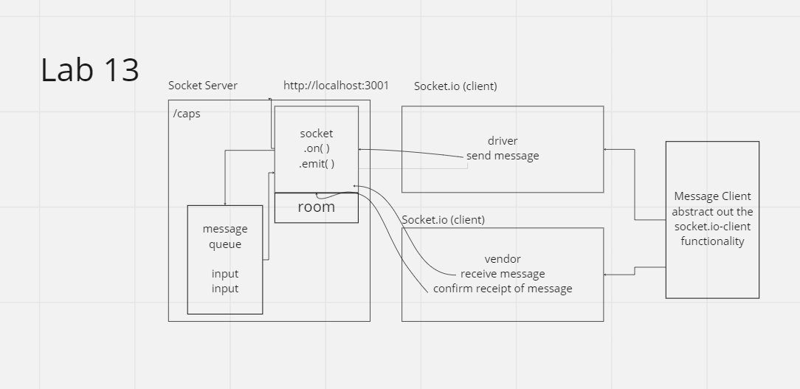

# LAB - Class 13

## Project: CAPS Phase 3
Within Phase 2 was implementation of usage of sockets. In Phase 3 there will be implementation of queues. Within queues are methods that are supposed to be used and handlers that will allow for multiple actions to take place at once.

### Author: Jacob Dang

### Problem Domain
Implementing to both clients specific handlers and refactoring of logic within code. Utilizing rooms and queues to publish and subscribe the vendor and driver clients, this would substitute Phase 2 and make the code more approachable and efficient

### Credits
Credit to instructor Ryan Gallaway for UML & Code Build

### Links & Resources
{GitHub Actions} {URL}
{Deployed Database} {}

see '.env.sample'

### Features/Routes:
- Vendor Client module: acme-widgets
- getAll event
- Subscribe & Publish

#### Tests
- How do you run tests?
    - node server.js & web application

## UML
