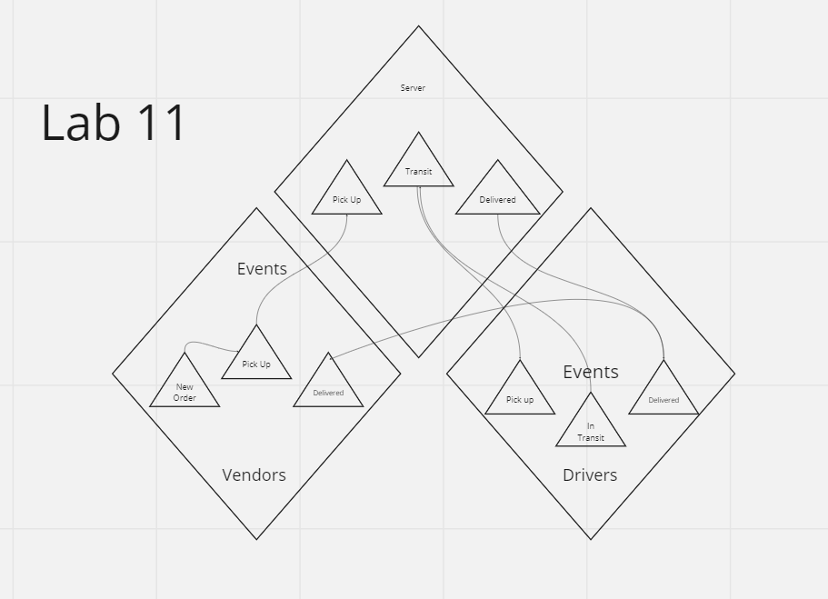

# LAB - Class 11

## Project: CAPS Phase 1

### Author: Jacob Dang

### Problem Domain
In a 4-Phase build, we are supposed to implement and setup a pool of events and handler functions. By building out a hub, creating two client applications, and written unit tests, this phase of the build is meant to demonstrate how event driven applications function

### Credits
Credit to instructor Ryan Gallaway for code build

### Links & Resources
{GitHub Actions} {URL}
{Deployed Database} {}

see '.env.sample'

### Features/Routes:
- Event Pools
- Event Handlers

#### Tests
- How do you run tests?
    - node server.js

## UML
