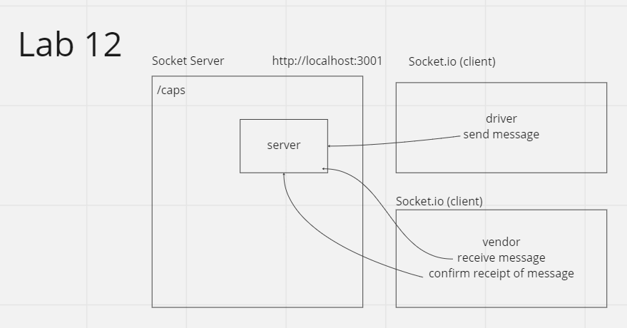

# LAB - Class 12

## Project: CAPS Phase 2
Phase 2 requires a refactor using Socket.io libraries. Allowing for communication between server and client applications.

The intent here is to build the data services that would drive a suite of applications where we can see pickups and deliveries in real-time.

### Author: Jacob Dang

### Problem Domain
Given Phase 1 demonstrated how event handling as well as listening works, 
Phase 2 seeks to expand upon that idea through refactoring how event listening works using Socket and Socket.Io

### Credits
Credit to instructor Ryan Gallaway for UML & Code Build

### Links & Resources
{GitHub Actions} {URL}
{Deployed Database} {}

see '.env.sample'

### Features/Routes:
- Feature 1: /caps
- Feature 2: PICKUP, IN-TRANSIT, DELIVERED emits

#### Tests
- How do you run tests?
    - node server.js, node driver, node vendor

## UML
